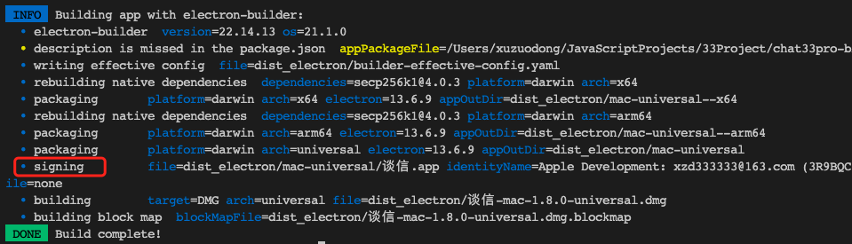

# Chat33Pro 网页版

## 这是什么?

### 业务

即时通讯 App, 用户信息存放在区块链上, 支持跨服务器聊天. 

### 部署

支持网页, Windows 和 macOS. 
## 安装

使用 npm 而不是 yarn 或 pnpm, 因为 [Vue CLI Plugin Electron Builder](https://nklayman.github.io/vue-cli-plugin-electron-builder/) 对后者支持不好, 启动项目会报错. 

```
npm install
```

### npm 镜像配置

安装 Electron 包时, 会下载二进制文件, 而默认路线很慢. 可以配置镜像以提升下载速度. 

- 方式一

在命令前面加 `ELECTRON_MIRROR` 环境变量, 以加快 Electron 二进制文件下载速度

```
ELECTRON_MIRROR="https://cdn.npm.taobao.org/dist/electron/" npm run install
```

- 方式二 (推荐)

[参考这篇文章](https://antfu.me/posts/npm-binary-mirrors)

## 构建时遇到的问题

### Electron

Mac 版本的构建需要 `Signing` 步骤没有问题, 如下图所示: 



如果构建时这一步骤前面的点是黄色，Mac 版本的截图会不正常。

`Signing` 步骤需本地存在开发者账户,可在 Mac 电脑上安装 Xcode, 然后登录一个开发者账号，最后回到项目进行构建即可。